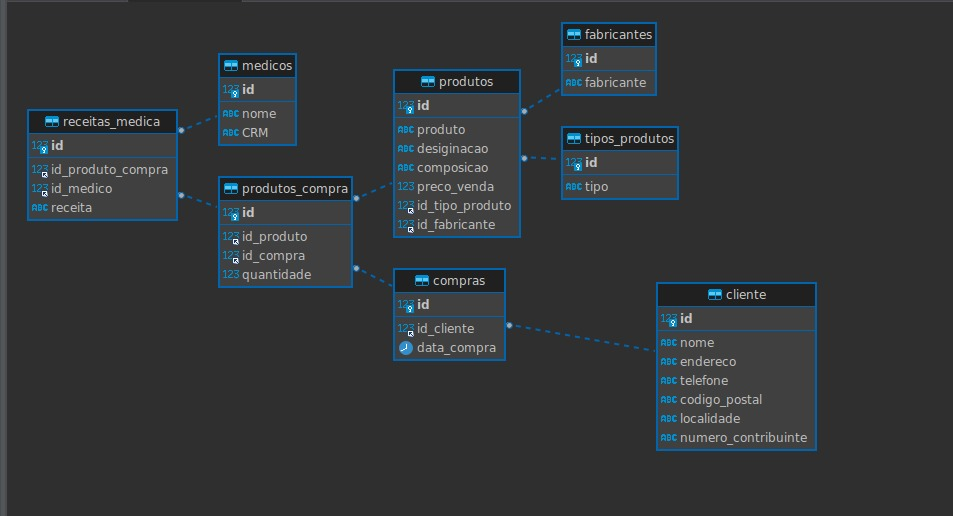

# Trabalho de Gestão do Ciclo de Vida e Aplicação

## Integrantes

- João Paulo de Campos Carvalho

- Paulo César Moraes de Menezes

- Rafael Silva Fortuna

## Sobre o projeto:

O projeto consiste em um sistema de gerenciamento de uma farmacia, onde é possível cadastrar clientes, produtos e vendas.

O projeto foi desenvolvido utilizando Java 21, e para a sua execução é necessário instalar os plugins do ```Lombok``` e para realizar o acesso do swagger é através da url: ```http://localhost:8080/swagger-ui/index.html```

Para criar o banco de dados, basta utilizar o script do Dump que está na pasta ```DB-SQL-scripts```.

## Sobre o desenvolvimento:

O projeto foi desenvolvido através de separação de camadas, onde cada camada tem sua responsabilidade, sendo elas:

- Controller: Responsável por receber as requisições e retornar as respostas.

- Service: Responsável por implementar a lógica de negócio.

- Repository: Responsável por implementar a lógica de acesso a dados.

O banco de dados utilizado foi o ``mysql``.

O MER do banco de dados é o seguinte:



Observe que o banco de dados possuí 8 tabelas, sendo todas elas relacionadas entre si.

